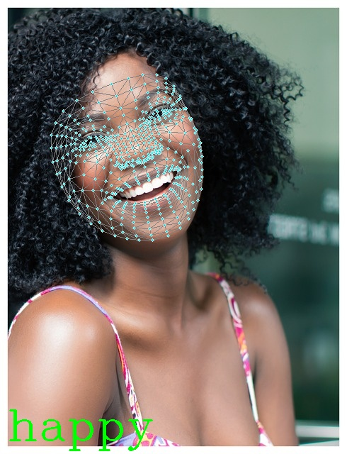

# Распознавание эмоций
Датасет был сгенерирован с использованием [модели Stable Diffusion](https://huggingface.co/stabilityai/stable-diffusion-xl-base-1.0). Генерация изображений осуществлялась в google colab ([ноутбук](https://colab.research.google.com/drive/19e7sjE1R8dgxpzs7BU4_N6QO0UGVpAyp?usp=sharing)). Готовый датасет доступен [здесь](https://drive.google.com/drive/folders/1rg4Q_fYtbKaS6B2VZ6M0DcCgD9RLqqg5?usp=sharing). Для нахождения ключевых точек использовалась библиотека Mediapipe ([face landmarker model](https://developers.google.com/mediapipe/solutions/vision/face_landmarker#models)). Для классификации точек использовалась библиотека Scikit-learn.
# Результаты
<table>
  <tr>
    <td></td>
    <td></td>
  </tr>
  <tr>
    <td></td>
    <td></td>
  </tr>
  <tr>
    <td></td>
    <td></td>
  </tr>
  <tr>
    <td></td>
    <td></td>
  </tr>
  <tr>
    <td></td>
    <td></td>
  </tr>
</table>

# Использование
1. Создать виртуальную среду с `python 3.11` и установить `requirements.txt`
2. Выполнить `python inference_model.py`. Можно дополнительно указать путь до папки или файла, которые нужно обработать. По умолчанию изображения и видео берутся из папки `assets`.
3. Результаты выполнения будут сохранены в папке `output`.
4. Для обработки с вебкамеры выполнить python `webcam.py`. Для выхода нажать `q`.

# Известные проблемы
Для обучения использовался небольшой набор искуственно сгенерированных данных. Модель имеет сложности с распознаванием эмоций с данных, отличающихся от тренировочных.
